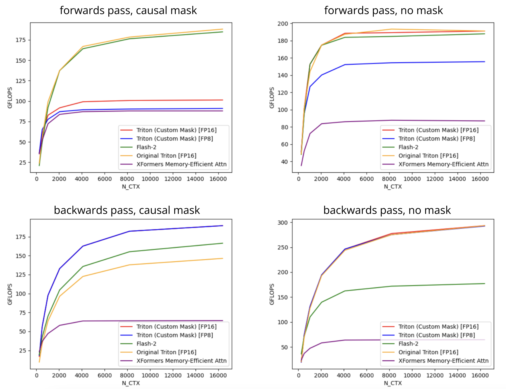

# FlashAttention2 with Custom Masks 🎭
For efficiency purposes, the standard implementations of FlashAttention currently do not support **arbitrary custom masks**. 
Their implementation of specific masks like causal masking for language modeling are implemented using branch logic to save memory. This repository is just a modified version of the tutorial Triton implementation of FlashAttention2 that allows the user
to define a (batch of) custom mask. It modifies both the forward and backwards pass to handle custom masking (you can define a different mask per head and batch).
 
Original Triton code: [https://triton-lang.org/main/getting-started/tutorials/06-fused-attention.html](https://triton-lang.org/main/getting-started/tutorials/06-fused-attention.html)

## Example Setup
The relevant libraries needed to use the custom-mask FlashAttention2 kernel are below:
```
pip install triton>=3.0.0
pip install torch
```

#### For Viewing Benchmarking Results
Other libraries for evaluating the performance of the models is below. These are primarily for `test_benchmark.py`, which verifies the correctness of the implementation.
```
pip install pytest
pip install matplotlib
pip install pandas
```
To compare with the official FlashAttention and `xformers.ops.memory_efficient_attention` implementations, make sure to install both libraries separately (follow the instructions on these repositories).
```
pip install flash-attn --no-build-isolation
pip3 install -U xformers --index-url https://download.pytorch.org/whl/cu121
```

## Testing Correctness
There are two `pytest` functions in `test_benchmark.py`, one that tests whether a reference implementation of multi-head attention with a causal mask matches the Triton version in both the forward pass and backwards pass gradients. The second tests whether the same implementation with **random** masks matches the Triton version. You can modify these tests to do more rigorous correctness tests and check with `pytest`.

## Simple Example
You can insert this module into your standard attention pipeline.
```python
from fa2_custom_mask import flash_attention_custom_mask

B, H, L, D = 4, 16, 4096, 64
fp32_q = torch.randn(B, H, L, D).float().cuda()
fp32_k = torch.randn(B, H, L, D).float().cuda()
fp32_v = torch.randn(B, H, L, D).float().cuda()
mask = torch.randint(0, 2, (B, 1, L, D)).int().cuda()
mask = torch.broadcast_to(mask, (B, H, L, D))

out = flash_attention_custom_mask(fp32_q, fp32_k, fp32_v, mask=mask)
...
out.backward(loss)
```

## Benchmarking
Simple benchmark against the base Triton implementation. In our custom mask version, we pass in the canonical causal mask as input (hence storing in global device memory). Running `test_benchmark.py`,
with batch size=4, # heads=16, hidden dim=64, and sequence length `N_CTX` ranging from 256 to 16384 in powers of 2. You can replicate the experiments by running
```
pytest
python test_benchmark.py
```

#### Causal Masks and No Masks Comparisons 
We compare against the original experiments and original implementation, as well as the official FlashAttention and xformers implementation (note: there seems to be a versioning issue, so it's using a different implementation. I corrected the version in the later benchmarking experiments). 

 
#### Causal Masks and No Masks Comparisons (with Correct xfrormers version)
We compare against the original experiments and original implementation, as well as the xformers implementation. Notably, the original implementation does well for causal masking because of some pipelining tricks and ability to not have to store masks.

#### Custom Masking Comparison
We compare directly to the [xformers memory efficient attention](https://facebookresearch.github.io/xformers/components/ops.html) which allows for custom masking. We generate random masks (fixed across the head dimension).


## Notes and Bugs
1. This implementation only works on Ampere devices and up. I originally tried running it on a V100 (Volta) and it failed. 
2. You need to be on `triton>=3.0.0`, or it'll complain about permutation indices on the value vector pointer. The `torch` and `flash-attn` libraries may force you to install `triton=2.x.x`, but you can just re-install `triton>=3.0.0` and it should work. I may fix this manually in the future.
    * This is oddly specific, but I'm not able to have `flash-attn` and `xformers` at the same time. I had to run them separately and generate the plots.

If time permits, I'm interested in making this implementation generalizable / changing the CUDA implementation for FA3 (if it's necessary of course). I also probably will run some more realistic workloads and see what happens.


